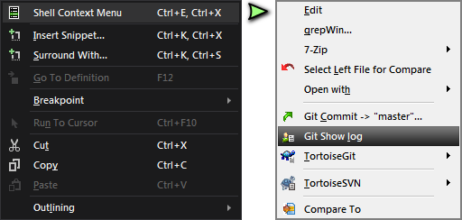

# Visual Studio Shell Context Menu Extension

## Download
- Search for "shell context menu" in Visual Studio's built-in extensions manager.
- From the [VS Marketplace](https://marketplace.visualstudio.com/items?itemName=NanangP.ShellContextMenu).
- From GitHub's [Releases](../../releases/latest) page.

## Overview
This extension will add an extra menu item to the Visual Studio code window 
(and solution explorer) to show the *shell context menu* of the selected file.

It was born out of frustration on having to do "Open containing folder" to 
perform any file operation, then eventually closing the explorer window 
when finished. Well, no more of that!

Plus, you're got the whole code window to right click on, instead of having 
to aim for the small file tab > right click > open folder > look for the file > 
right click again > etc..

## Notes:
- Since the VS shell is 32-bit, the context menu you see would be the
  32-bit context menu, not the 64-bit one.
- Because we are still supporting older VS shells (VS2012/11.0) we
  cannot take advantage of the new async loading of extension packages.
  Shouldn't be an issue, as the loading doesn't actually do much work.

## What's New

See full [changelog](src/VsShellContext/Changelog.md).
- **v2.0** This is it. Built for the year 2020. Supports VS2012-2019. 
- **v1.3** Hopefully fixes random crashing.
- **v1.2** Supports right-clicking projects in Solution Explorer.
- **v1.1** Integration with files in Solution Explorer. 
Also works on multiple selections - provided the files are in the same physical folder.
